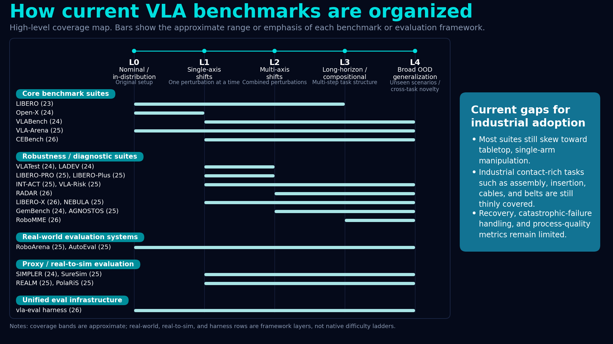



<div align="center">
  <h1>🤖 Vision-Language-Action (VLA) Evaluation Hub</h1>
  <p><i>A curated and organized hub for evaluating generalist robot policies: benchmarks, world-model proxies, autonomous judges, statistical frameworks, and runtime safety monitors.</i></p>
  
  [](https://awesome.re)
  [](#)
  [](#)
</div>

---

## 🧭 The State of VLA Evaluation (recent trends: 2025–2026)
VLA evaluation is expanding beyond fixed simulator scripts toward more scalable and physically grounded approaches. If you are developing or deploying VLA models, these are common frontiers in the recent literature:

1. **Autonomous judges over manual scripts:** Hand-written success criteria often don’t scale across long-horizon, open-ended tasks. Many works explore Foundation VLMs as reusable judges or reward models for scoring trajectories (*Robometer, RoboReward, TOPReward*).
2. **World-model proxies alongside simulators:** In addition to classic engines (e.g., MuJoCo), recent work uses generative world models and neural reconstruction to approximate evaluation conditions and probe out-of-distribution (OOD) behavior (*WorldGym, Ctrl-World, PolaRiS*).
3. **Statistical efficiency for hardware evaluation:** Real-world rollouts are informative but expensive. Methods like prediction-powered inference and sequential testing aim to compare policies with stronger statistical confidence under tight trial budgets (*SureSim*; see also automated real-world evaluation systems such as *AutoEval*).
4. **Safety & runtime introspection:** Deployment settings often require knowing *when* to defer, ask for help, or stop. Runtime uncertainty, failure reasoning, and OOD detection are increasingly treated as evaluation targets alongside capability (*ARMOR, FAIL-Detect, FIPER*).

---

The diagram below provides a compact taxonomy of VLA benchmark types and how they relate (capability vs stress testing, simulation vs proxy vs real-world, and where autonomous evaluation fits).




## 🗂️ Phase 1: Simulation Benchmarks & Diagnostic Suites
*The foundational tier. Measure core capabilities, long-horizon reasoning, and specific vulnerabilities (memory, spatial awareness) in deterministic environments.*

<details open>
<summary><b>🛠️ Core Benchmarks & Broad Generalization</b></summary>

| Year | Benchmark | Focus | Links |
| :---: | :--- | :--- | :--- |
| 2026 | **CEBench** | Cross-embodiment benchmark across sim/real with domain randomization. | [Paper](https://arxiv.org/abs/2602.22663) |
| 2026 | **RADAR** | Generalization via real-world dynamics, spatial-physical intelligence, and 3D eval. | [Paper](https://arxiv.org/abs/2602.10980) |
| 2026 | **LIBERO-X** | Hierarchical protocol with progressive difficulty over spatial/object generalization. | [Repo](https://github.com/zackhxn/LIBERO-X) |
| 2025 | **VLA-Arena** | Difficulty axes over task structure, language, and visual perturbations. | [Project](https://vla-arena.github.io/) |
| 2025 | **MultiNet (v1.0 & v0.2)** | Visual grounding, spatial reasoning, tool use, and procedural simulation. | [Project](https://multinet.ai/) |
| 2025 | **RoboCerebra** | Long-horizon System-2 style evaluation with decomposed substeps. | [Repo](https://github.com/qiuboxiang/RoboCerebra) |
| 2025 | **AGNOSTOS** | Limits of VLA manipulation in cross-task generalization. | [Project](https://jiaming-zhou.github.io/AGNOSTOS/) |
| 2024 | **VLABench** | Language-conditioned manipulation with long-horizon reasoning/randomization. | [Project](https://vlabench.github.io/) |
| 2024 | **GemBench** | Generalization covering rigid objects, articulated objects, and placements. | [Project](https://www.di.ens.fr/willow/research/gembench/) |
| 2024 | **LADEV & VLATest** | Language-driven environment generation and automatic fuzzing/robustness testing. | [Repo (VLATest)](https://github.com/ma-labo/VLATest) |
| 2024 | **Open-X Eval** | Cross-dataset evaluation framework spanning 20 Open-X-Embodiment datasets. | [Paper](https://arxiv.org/abs/2411.05821) |
| 2024 | **Colosseum** | 14 axes of perturbation with reported sim-to-real ecological validity. | [Project](https://robot-colosseum.github.io/) |
| 2023 | **LIBERO** | Widely used manipulation benchmark suite with many downstream baselines. | [Project](https://libero-project.github.io/main.html) |
</details>

<details>
<summary><b>🧩 Diagnostic & Robustness Stress-Testing</b></summary>

| Year | Benchmark | Focus | Links |
| :---: | :--- | :--- | :--- |
| 2026 | **RoboMME** | Standardized benchmark for temporal, spatial, object, and procedural memory. | [Project](https://robomme.github.io/) |
| 2026 | **Robust Skills, Brittle Grounding**| Controlled diagnostic stress test separating execution skill from instruction-grounding. | [Paper](https://arxiv.org/abs/2602.24143) |
| 2025 | **NEBULA** | Dual-axis ecosystem combining capability tests and stress tests for fine diagnosis. | [Project](https://vulab-ai.github.io/NEBULA-Alpha/) |
| 2025 | **LIBERO-PRO & Plus** | Perturbation-based extensions for evaluating beyond memorization (lighting, noise). | [Repo (Plus)](https://github.com/sylvestf/LIBERO-plus) |
| 2025 | **MV-RoboBench** | Multi-view spatial reasoning to diagnose perceptual grounding bottlenecks. | [Project](https://aaronfengzy.github.io/MV-RoboBench-Webpage/) |
| 2025 | **INT-ACT** | Probes whether strong perception/planning transfers to execution under OOD changes. | [Project](https://ai4ce.github.io/INT-ACT/) |
| 2025 | **VLA-Risk** | Risk benchmark spanning multiple attack surfaces and adversarial modalities. | [Paper](https://openreview.net/forum?id=31EjDFwFEe) |
</details>

---

## 🌍 Phase 2: World Models & Sim-to-Real Proxies
*Hardware is a bottleneck. These world-model and rendering pipelines are often used to rank or compare policies in-silico, sometimes complementing traditional simulators.*

<details open>
<summary><b>Generative Simulators & Digital Twins</b></summary>

| Year | System | Focus | Links |
| :---: | :--- | :--- | :--- |
| 2026 | **ALOE** | Action-level off-policy eval using mixed-source trajectory fragments. | [Paper](https://arxiv.org/abs/2602.12691) |
| 2025 | **REALM** | Realistic simulation benchmark motivated by (and compared against) real-world generalization trends. | [Project](https://martin-sedlacek.com/realm/) |
| 2025 | **PolaRiS** | Neural scene reconstruction pipeline for scalable real-to-sim evaluation (reported strong correlation in the paper). | [Paper](https://arxiv.org/abs/2512.16881) |
| 2025 | **Veo World Simulator** | Evaluates Gemini Robotics policies for nominal, OOD, and safety assessments. | [Paper](https://arxiv.org/abs/2512.10675) |
| 2025 | **Video World Models** | Evaluates policies using action-conditional video generation models. | [Paper](https://arxiv.org/abs/2511.11520) |
| 2025 | **Gaussian Splatting** | Soft-body digital twins and Gaussian Splatting for deformable-manipulation eval. | [Project](https://real2sim-eval.github.io/) |
| 2025 | **Ctrl-World** | Controllable multi-view world model for ranking instruction-following zero-shot. | [Project](https://ctrl-world.github.io/) |
| 2025 | **WorldGym & WorldEval** | World models as evaluation environments aiming to correlate with real-world policy rankings without hardware rollouts. | [Project](https://world-model-eval.github.io/) |
| 2024 | **SIMPLER** | Simulation environments designed to better correlate with real-world manipulation performance under distribution shift. | [Project](https://simpler-env.github.io/) |
</details>

---

## ⚖️ Phase 3: Autonomous Judges & Reward Models
*Using Foundation Vision-Language Models as reusable judges/reward models for trajectory scoring, progress estimation, and automatic evaluation signals.*

<details open>
<summary><b>Evaluator Models & VLM-as-a-Judge</b></summary>

| Year | Model | Focus | Links |
| :---: | :--- | :--- | :--- |
| 2026 | **Robometer** | Scalable reward modeling via trajectory comparisons, with a large trajectory evaluation dataset. | [Project](https://robometer.github.io/) |
| 2026 | **Rewarding DINO** | Compact language-conditioned dense reward model beyond expert trajectories. | [Paper](https://arxiv.org/abs/2603.16978) |
| 2026 | **Large Reward Models** | Foundation-VLM reward generator for general automatic evaluation. | [Paper](https://arxiv.org/abs/2603.16065) |
| 2026 | **TOPReward** | Zero-shot progress estimator derived directly from VLM token probabilities. | [Paper](https://arxiv.org/abs/2602.19313) |
| 2026 | **RoboReward** | General-purpose VLM reward dataset/benchmark for scoring trajectories. | [Paper](https://arxiv.org/abs/2601.00675) |
| 2025 | **Robo-Dopamine** | Step-aware multi-view *process* reward model for fine-grained assessment. | [Project](https://robo-dopamine.github.io/) |
| 2025 | **SARM** | Stage-aware video reward model for subtask-aware progress estimates. | [Paper](https://arxiv.org/abs/2509.25358) |
| 2025 | **VLA-Critic** | Unifies critic/policy, providing reusable progress and done-signal evaluation. | [Paper](https://arxiv.org/abs/2509.15937) |
| 2025 | **ReWiND** | Language-guided rewards that generalize to unseen tasks as evaluation signals. | [Project](https://rewind-reward.github.io/) |
| 2024 | **VLM Value Learners** | Training-free progress/value estimator for success detection and policy ranking. | [Paper](https://arxiv.org/abs/2411.04549) |
| 2024 | **Video-Language Critic** | Transferable video-language reward model across embodiments. | [Paper](https://arxiv.org/abs/2405.19988) |
| 2023 | **VLMs as Success Detectors** | Cross-domain success detection across sim, real, and in-the-wild videos. | [Paper](https://arxiv.org/abs/2303.07280) |
</details>

---

## 🏭 Phase 4: Real-World & Statistical Testing
*When transitioning to hardware, these frameworks apply statistical rigor to compare policies under strict sample budgets (e.g., confidence intervals, anytime-valid tests, and sample-efficient designs).*

<details open>
<summary><b>Statistical Evaluation & Policy Comparison</b></summary>

| Year | Methodology | Focus | Links |
| :---: | :--- | :--- | :--- |
| 2026 | **Sample-Efficient Robot Policy Eval** | Safe anytime-valid inference (SAVI) for pairwise comparison beyond binary success. | [Paper](https://arxiv.org/abs/2603.13616) |
| 2025 | **SureSim** | *Prediction-Powered Inference:* Combines sim trials + few real trials for tight intervals. | [Project](https://suresim-robot-eval.github.io/) |
| 2025 | **Policy Comparison** | Sequential statistical testing (near-optimal stopping) under limited eval budgets. | [Paper](https://arxiv.org/abs/2503.10966) |
| 2025 | **Active Exp. Selection** | Treats evaluation as population-parameter estimation via active experiment selection. | [Paper](https://arxiv.org/abs/2502.09829) |
| 2025 | **Confidence Calibration** | Remedies miscalibration in VLAs using prompt ensembles and Platt scaling. | [Paper](https://arxiv.org/abs/2507.17383) |
| 2024 | **Trustworthy Perf Eval (CDF)** | Confidence bounds on the full performance distribution from few rollouts. | [Paper](https://arxiv.org/abs/2405.05439) |
| 2024 | **Robot Learning Empirical Science**| Practical guide advocating explicit statistical analysis and standard reporting. | [Paper](https://arxiv.org/abs/2409.09491) |
| 2017-23 | **Bayesian & Risk Foundations** | Legacy risk bounds (VaR, CVaR), scenario approaches, and Bayesian IRL methods. | *See raw CSV for 2017-2023 list* |
</details>

<details>
<summary><b>Hardware Evaluation Platforms</b></summary>

| Year | Platform | Focus | Links |
| :---: | :--- | :--- | :--- |
| 2026 | **TERM-Bench** | Trustworthy benchmark with AutoEval methods correlating to human judgments. | [Project](https://term-bench.github.io/) |
| 2025 | **AutoEval** | Autonomous 24/7 real-world evaluation with success detection and auto-resets. | [Project](https://auto-eval.github.io/) |
| 2025 | **RoboArena** | Distributed, double-blind, pairwise real-world evaluation across sites. | [Paper](https://arxiv.org/abs/2506.18123) |
| 2025 | **LBM1 Case Study** | Careful sim/real evaluation protocol for multitask dexterous manipulation. | [Project](https://toyotaresearchinstitute.github.io/lbm1/) |
</details>

---

## 🛡️ Phase 5: Runtime Safety, Failure Detection & Uncertainty
*For industrial deployment, a VLA must recognize its own boundaries. These tools monitor runtime execution, predict failures, and quantify confidence.*

<details open>
<summary><b>🚨 Failure Prediction, Reasoning & Recovery</b></summary>

| Year | System | Focus | Links |
| :---: | :--- | :--- | :--- |
| 2026 | **ARMOR** | Open-ended failure detection and reasoning with iterative self-refinement. | [Project](https://sites.google.com/utexas.edu/armor) |
| 2026 | **Vision Overrides Language** | Evaluates counterfactual failures where visual priors override text instructions. | [Project](https://vla-va.github.io/) |
| 2025 | **Guardian** | Failure-synthesis pipeline + VLM for detecting planning/execution errors. | [Paper](https://arxiv.org/abs/2512.01946) |
| 2025 | **ViFailback & RoboFAC** | Real-world datasets/benchmarks for failure diagnosis and correction guidance. | [Project](https://x1nyuzhou.github.io/vifailback.github.io/) |
| 2025 | **PACS** | Path-consistent safety filtering for diffusion policies with formal guarantees. | [Project](https://tum-lsy.github.io/pacs/) |
| 2025 | **FIPER** | Runtime failure prediction using OOD observations and action-chunk entropy. | [Project](https://tum-lsy.github.io/fiper_website/) |
| 2025 | **FailSafe & SAFE** | Failure reasoning, multi-task detection, and recovery evaluation under errors. | [Paper](https://arxiv.org/abs/2510.01642) |
| 2025 | **FAIL-Detect** | Sequential OOD failure detection using conformal prediction (*no failure data needed*). | [Project](https://cxu-tri.github.io/FAIL-Detect-Website/) |
| 2025 | **ARMADA** | Shared-control deployment system with online failure detection for scaling. | [Repo](https://github.com/Virlus/armada) |
| 2025 | **FORTRESS** | Real-time prevention of OOD failures via multi-modal reasoning/fallback planning. | [Project](https://milanganai.github.io/fortress/) |
| 2024 | **AHA** | VLM for detecting and free-form reasoning over robotic manipulation failures. | [Paper](https://arxiv.org/abs/2410.00371) |
</details>

<details>
<summary><b>🤔 Introspection, Uncertainty & Robustness</b></summary>

| Year | System | Focus | Links |
| :---: | :--- | :--- | :--- |
| 2026 | **UAOR & SCALE** | Adaptive perception and observation reinjection based on self-uncertainty. | [Project](https://uaor.jiabingyang.cn) |
| 2026 | **Metamorphic Testing** | Framework that reduces the test-oracle burden for VLA-enabled robots. | [Paper](https://arxiv.org/abs/2602.22579) |
| 2025 | **VLA_UQ** | 8 uncertainty metrics and 5 quality metrics beyond binary task success. | [Repo](https://github.com/pablovalle/VLA_UQ) |
| 2025 | **Ask Before You Act** | Token-level uncertainty for deciding when a robot should ask for help or defer. | [Paper](https://openreview.net/forum?id=NX0euXAv98) |
| 2024 | **BYOVLA** | Runtime observation intervention improving visual robustness without changing weights. | [Project](https://aasherh.github.io/byovla/) |
</details>

---

## 📚 Surveys, Toolkits & Unified Harnesses
*Meta-resources for broad literature understanding and standardized testing.*

| Year | Resource | Focus | Links |
| :---: | :--- | :--- | :--- |
| 2026 | **vla-evaluation-harness** | Unified evaluation harness and leaderboard spanning multiple robot simulators. | [Repo](https://github.com/allenai/vla-evaluation-harness) |
| 2025 | **VLA Review (Real-World)** | Practical survey with dedicated coverage of evaluation benchmarks. | [Project](https://vla-survey.github.io/) |
| 2025 | **Pure VLA Models Survey** | Broad survey of VLA methods, datasets, benchmarks, and simulators. | [Paper](https://arxiv.org/abs/2509.19012) |
| 2025 | **Action Tokenization Survey** | Tracing evaluation papers through action-tokenization literature. | [Paper](https://arxiv.org/abs/2507.01925) |
| 2025 | **MultiNet Toolkit** | Open-source ecosystem for standardized eval across multimodal action tasks. | [Project](https://multinet.ai/) |
| 2025 | **STAR-Gen Taxonomy** | Reproducible guidelines for measuring visual, semantic, and behavioral generalization. | [Project](https://stargen-taxonomy.github.io/) |
| - | **Manipulation-Net** | Downloadable components for running benchmarks. | [Site](https://manipulation-net.org/) |

---

### 📌 Inclusion Policy
This repository is strictly **evaluation-focused**. Included items must:
1. Introduce a benchmark, leaderboard, or explicit testing platform for VLAs.
2. Propose a runtime metric, uncertainty signal, or autonomous evaluator (VLM-as-Judge).
3. Provide sim-to-real pipelines, safety filters, or statistical testing methodologies usable by roboticists.
*(General VLA architecture or data-collection papers are excluded unless they introduce a distinct evaluation protocol).*

<div align="center">
  <br>
  <i>Maintained by <a href="https://github.com/gokul-narayanan-1">@gokul-narayanan</a>. If this resource assists your research or deployment, please consider leaving a <b>Star ⭐</b></i>
</div>
```