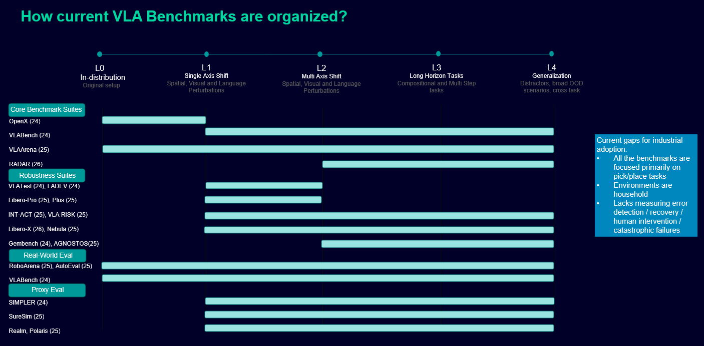

# VLA Evaluation Systems
A curated, repo-ready list of **evaluation systems, benchmarks, and runtime assessment methods for Vision-Language-Action (VLA) models**.
This repo is intentionally **evaluation-only**. In scope are: benchmarks, leaderboards, testing platforms, probing suites, autonomous evaluators, reward/evaluation models, simulation and world-model evaluation systems, uncertainty metrics, failure predictors, OOD detectors, deployment-time monitors, and policy-comparison methodology. General VLA model papers are out of scope unless they introduce a concrete evaluation protocol, evaluator, or benchmark.

The **Benchmarks overview** figure below is a quick map of the evaluation landscape covered here: benchmarks/suites vs harnesses/leaderboards vs evaluator/judge models, spanning simulation, world-model proxy, and real-world evaluation settings.
Use it to orient; the sections below link out to the underlying papers, code, and leaderboards.

<!-- ## Benchmark evolution (timeline)

- **x-axis**: publication time inferred from arXiv ID (month resolution)
- **y-axis**: evaluation setting / where the evaluation “lives” (simulation, world-model proxy, real-world, runtime assessment, etc.)
- **color**: contribution type (benchmark/suite vs harness vs evaluator model vs method/metric)

(Note: the plot + generation scripts are kept local and not committed.)
-->

<!-- ## Discovery policy
- **Seed material**: the user-provided `Resources.pdf` and `literature.md`
- **Round 1**: original expansion pass
- **Round 2**: cited-by and co-citation expansion from the first README corpus
- **Round 3**: deeper traversal of the existing corpus through **references, cited-by neighborhoods, and reward-model / automatic-evaluator literature**
- **Strict scope filter**: only papers with a meaningful **evaluation contribution** were kept -->

<!-- ## Suggested tags
- `benchmark`
- `leaderboard`
- `real-world`
- `reward-model`
- `success-detector`
- `policy-comparison`
- `off-policy-eval`
- `sim-to-real`
- `world-model-eval`
- `uncertainty`
- `failure-detection`
- `OOD`
- `safety`
- `autoeval` -->

## Surveys & meta-resources
| Year | Resource | Focus | Links |
| --- | --- | --- | --- |
| 2026 | vla-evaluation-harness | Unified open evaluation harness and leaderboard spanning many robot simulation benchmarks. | [paper](https://arxiv.org/abs/2603.13966)  · [repo](https://github.com/allenai/vla-evaluation-harness)  · [leaderboard](https://allenai.github.io/vla-evaluation-harness/leaderboard/) |
| 2025 | Vision-Language-Action Models for Robotics: A Review Towards Real-World Applications | Practical survey with dedicated coverage of evaluation benchmarks and a maintained project table. | [paper](https://arxiv.org/abs/2510.07077)  · [project](https://vla-survey.github.io/) |
| 2025 | Pure Vision Language Action (VLA) Models: A Comprehensive Survey | Broad survey of VLA methods, datasets, benchmarks, and simulators. | [paper](https://arxiv.org/abs/2509.19012) |
| 2025 | A Survey on Vision-Language-Action Models: An Action Tokenization Perspective | Useful for tracing evaluation papers through action-tokenization and policy-design literature. | [paper](https://arxiv.org/abs/2507.01925) |
| 2025 | MultiNet: An Open-Source Software Toolkit & Benchmark Suite for Multimodal Action Models | Open-source benchmark ecosystem and tooling for standardized evaluation and adaptation across multimodal action tasks. | [paper](https://arxiv.org/abs/2506.09172)  · [repo](https://github.com/ManifoldRG/MultiNet)  · [project](https://multinet.ai/) |
| 2025 | A Taxonomy for Evaluating Generalist Robot Manipulation Policies | STAR-Gen taxonomy and reproducible guidelines for measuring visual, semantic, and behavioral generalization of generalist robot policies. | [paper](https://arxiv.org/abs/2503.01238)  · [project](https://stargen-taxonomy.github.io/) |
|  | Manipulation-Net | Resource hub for robotic manipulation benchmarking; provides downloadable components for running benchmarks. | [site](https://manipulation-net.org/) |
## Benchmarks
| Year | Resource | Focus | Links |
| --- | --- | --- | --- |
| 2026 | RoboMME: Benchmarking and Understanding Memory for Robotic Generalist Policies | Standardized benchmark for temporal, spatial, object, and procedural memory in long-horizon robotic manipulation. | [paper](https://arxiv.org/abs/2603.04639)  · [project](https://robomme.github.io/) |
| 2026 | Robust Skills, Brittle Grounding: Diagnosing Restricted Generalization in Vision-Language Action Policies via Multi-Object Picking | Controlled diagnostic stress test that separates primitive execution skill from instruction-grounded task success under distribution shift. | [paper](https://arxiv.org/abs/2602.24143) |
| 2026 | Rethinking the Practicality of Vision-language-action Model: A Comprehensive Benchmark and An Improved Baseline (CEBench) | Cross-embodiment benchmark across simulation and real-world mobile/manipulation settings with explicit domain randomization. | [paper](https://arxiv.org/abs/2602.22663) |
| 2026 | RADAR: Benchmarking Vision-Language-Action Generalization via Real-World Dynamics, Spatial-Physical Intelligence, and Autonomous Evaluation | Real-world benchmark stressing physical dynamics, spatial reasoning, and autonomous 3D evaluation. | [paper](https://arxiv.org/abs/2602.10980) |
| 2026 | LIBERO-X | Hierarchical evaluation protocol with progressive difficulty over spatial generalization, object recognition, and instruction understanding. | [paper](https://arxiv.org/abs/2602.06556)  · [repo](https://github.com/zackhxn/LIBERO-X) |
| 2025 | VLA-Arena | Structured VLA benchmark with difficulty axes over task structure, language, and visual perturbations. | [paper](https://arxiv.org/abs/2512.22539)  · [repo](https://github.com/PKU-Alignment/VLA-Arena)  · [project](https://vla-arena.github.io/) |
| 2025 | Benchmarking the Generality of Vision-Language-Action Models (MultiNet v1.0) | Cross-domain benchmark and leaderboard spanning visual grounding, spatial reasoning, tool use, physical commonsense, multi-agent coordination, and continuous control. | [paper](https://arxiv.org/abs/2512.11315)  · [repo](https://github.com/ManifoldRG/MultiNet)  · [project](https://multinet.ai/) |
| 2025 | Seeing Across Views: Benchmarking Spatial Reasoning of Vision-Language Models in Robotic Scenes (MV-RoboBench) | Multi-view spatial reasoning benchmark for robotic scenes; useful for diagnosing perceptual grounding bottlenecks that affect VLAs. | [paper](https://arxiv.org/abs/2510.19400)  · [repo](https://github.com/microsoft/MV-RoboBench)  · [project](https://aaronfengzy.github.io/MV-RoboBench-Webpage/) |
| 2025 | NEBULA: Do We Evaluate Vision-Language-Action Agents Correctly? | Dual-axis evaluation ecosystem combining capability tests and stress tests for finer-grained diagnosis than end-task success. | [paper](https://arxiv.org/abs/2510.16263)  · [repo](https://github.com/JerryPeng0201/NEBULA)  · [project](https://vulab-ai.github.io/NEBULA-Alpha/) |
| 2025 | LIBERO-PRO | Perturbation-based LIBERO extension for evaluating beyond memorization. | [paper](https://arxiv.org/abs/2510.03827)  · [repo](https://github.com/Zxy-MLlab/LIBERO-PRO) |
| 2025 | LIBERO-Plus | Fine-grained robustness analysis across camera, robot init, language, lighting, background, sensor noise, and scene layout. | [paper](https://arxiv.org/abs/2510.13626)  · [repo](https://github.com/sylvestf/LIBERO-plus) |
| 2025 | RoboCerebra: A Large-scale Benchmark for Long-horizon Robotic Manipulation Evaluation | System-2-style long-horizon evaluation with decomposed substeps, dynamic scene variations, and time-segment annotations. | [paper](https://arxiv.org/abs/2506.06677)  · [repo](https://github.com/qiuboxiang/RoboCerebra) |
| 2025 | From Intention to Execution: Probing the Generalization Boundaries of Vision-Language-Action Models (INT-ACT) | Simulation suite probing whether strong perception/planning transfers to robust execution under OOD changes. | [paper](https://arxiv.org/abs/2506.09930)  · [project](https://ai4ce.github.io/INT-ACT/) |
| 2025 | Exploring the Limits of Vision-Language-Action Manipulations in Cross-task Generalization (AGNOSTOS) | Benchmark for zero-shot cross-task generalization on unseen manipulation tasks, with two difficulty levels. | [paper](https://arxiv.org/abs/2505.15660)  · [repo](https://github.com/jiaming-zhou/X-ICM)  · [project](https://jiaming-zhou.github.io/AGNOSTOS/) |
| 2025 | Benchmarking Vision, Language, & Action Models in Procedural Simulation (MultiNet v0.2) | Procedural-simulation benchmark for analyzing OOD visual and mechanics shifts in VLM/VLA models. | [paper](https://arxiv.org/abs/2505.05540)  · [repo](https://github.com/ManifoldRG/MultiNet)  · [project](https://multinet.ai/) |
| 2024 | VLABench | Large-scale benchmark for language-conditioned manipulation with long-horizon reasoning and broad task randomization. | [paper](https://arxiv.org/abs/2412.18194)  · [repo](https://github.com/OpenMOSS/VLABench)  · [project](https://vlabench.github.io/) |
| 2024 | Benchmarking Vision, Language, & Action Models on Robotic Learning Tasks | Cross-dataset evaluation framework spanning 20 Open-X-Embodiment datasets. | [paper](https://arxiv.org/abs/2411.05821) |
| 2024 | Towards Generalizable Vision-Language Robotic Manipulation: A Benchmark and LLM-guided 3D Policy (GemBench) | Generalization benchmark covering rigid objects, articulated objects, placements, and long-horizon tasks. | [paper](https://arxiv.org/abs/2410.01345)  · [repo](https://github.com/vlc-robot/robot-3dlotus)  · [project](https://www.di.ens.fr/willow/research/gembench/) |
| 2024 | LADEV: A Language-Driven Testing and Evaluation Platform for Vision-Language-Action Models in Robotic Manipulation | Language-driven environment generation plus paraphrasing and batch testing for scalable VLA evaluation. | [paper](https://arxiv.org/abs/2410.05191) |
| 2024 | VLATest | Automatic scene-generation and fuzzing framework for robustness testing of VLA manipulation policies. | [paper](https://arxiv.org/abs/2409.12894)  · [repo](https://github.com/ma-labo/VLATest) |
| 2024 | THE COLOSSEUM: A Benchmark for Evaluating Generalization for Robotic Manipulation | Manipulation benchmark with 14 axes of perturbation and reported sim-to-real ecological validity. | [paper](https://arxiv.org/abs/2402.08191)  · [project](https://robot-colosseum.github.io/) |
| 2023 | LIBERO | Widely used manipulation benchmark that many VLA papers still report on. | [paper](https://arxiv.org/abs/2306.03310)  · [repo](https://github.com/Lifelong-Robot-Learning/LIBERO)  · [project](https://libero-project.github.io/main.html) |
|  | VLA-Risk | Risk benchmark spanning multiple attack surfaces and modalities for VLA systems. | [paper](https://openreview.net/forum?id=31EjDFwFEe) |
## External / real-world evaluation
| Year | Resource | Focus | Links |
| --- | --- | --- | --- |
| 2026 | Sample-Efficient and Statistically Rigorous Robot Policy Evaluation | SAVI-based sequential evaluation framework that reduces hardware evaluation burden while supporting richer metrics than binary success. | [paper](https://arxiv.org/abs/2603.13616) |
| 2026 | Trustworthy Evaluation of Robotic Manipulation: A New Benchmark and AutoEval Methods (TERM-Bench) | Trustworthy robotic evaluation benchmark with automatic quality assessment methods and strong correlation to human judgments. | [paper](https://arxiv.org/abs/2601.18723)  · [project](https://term-bench.github.io/) |
| 2025 | A Careful Examination of Large Behavior Models for Multitask Dexterous Manipulation | Careful simulation-plus-real-world evaluation protocol over seen and unseen multitask dexterous settings. | [paper](https://arxiv.org/abs/2507.05331)  · [project](https://toyotaresearchinstitute.github.io/lbm1/) |
| 2025 | RoboArena | Distributed, double-blind, pairwise real-world evaluation across sites and tasks. | [paper](https://arxiv.org/abs/2506.18123) |
| 2025 | Is Your Imitation Learning Policy Better than Mine? Policy Comparison with Near-Optimal Stopping | Sequential statistical test for comparing robot policies under limited evaluation budgets. | [paper](https://arxiv.org/abs/2503.10966) |
| 2025 | AutoEval: Autonomous Evaluation of Generalist Robot Manipulation Policies in the Real World | Around-the-clock real-world evaluation with automatic success detection and automatic scene resets. | [paper](https://arxiv.org/abs/2503.24278)  · [project](https://auto-eval.github.io/) |
## Reward-model based evaluation / automatic judges
| Year | Resource | Focus | Links |
| --- | --- | --- | --- |
| 2026 | Robometer: Scaling General-Purpose Robotic Reward Models via Trajectory Comparisons | Scalable reward-modeling framework with trajectory comparisons and a 1M-trajectory evaluation dataset. | [paper](https://arxiv.org/abs/2603.02115)  · [project](https://robometer.github.io/) |
| 2026 | Rewarding DINO: Predicting Dense Rewards with Vision Foundation Models | Compact language-conditioned dense reward model aimed at generalizing reward prediction beyond expert trajectories. | [paper](https://arxiv.org/abs/2603.16978) |
| 2026 | Large Reward Models: Generalizable Online Robot Reward Generation with Vision-Language Models | Foundation-VLM reward generator for online robotic policy refinement; useful as a general automatic evaluator. | [paper](https://arxiv.org/abs/2603.16065) |
| 2026 | TOPReward: Token Probabilities as Hidden Zero-Shot Rewards for Robotics | Zero-shot progress estimator from VLM token probabilities, introduced alongside ManiRewardBench for reward-model evaluation. | [paper](https://arxiv.org/abs/2602.19313) |
| 2026 | RoboReward: General-Purpose Vision-Language Reward Models for Robotics | Reward dataset and benchmark for scoring robot trajectories with vision-language reward models. | [paper](https://arxiv.org/abs/2601.00675) |
| 2025 | Robo-Dopamine: General Process Reward Modeling for High-Precision Robotic Manipulation | Step-aware multi-view process reward model for fine-grained manipulation assessment and reward shaping. | [paper](https://arxiv.org/abs/2512.23703)  · [project](https://robo-dopamine.github.io/) |
| 2025 | SARM: Stage-Aware Reward Modeling for Long Horizon Robot Manipulation | Stage-aware video reward model for long-horizon manipulation with subtask-aware progress estimates. | [paper](https://arxiv.org/abs/2509.25358) |
| 2025 | A Vision-Language-Action-Critic Model for Robotic Real-World Reinforcement Learning | General process reward model that unifies critic and policy; included for its reusable progress and done-signal evaluation. | [paper](https://arxiv.org/abs/2509.15937) |
| 2025 | ReWiND: Language-Guided Rewards Teach Robot Policies without New Demonstrations | Language-conditioned reward function that generalizes to unseen tasks and can serve as a reusable evaluation signal. | [paper](https://arxiv.org/abs/2505.10911)  · [project](https://rewind-reward.github.io/) |
| 2024 | Vision Language Models are In-Context Value Learners | Training-free progress/value estimator used for success detection, dataset filtering, and policy ranking across many robot tasks. | [paper](https://arxiv.org/abs/2411.04549) |
| 2024 | Video-Language Critic: Transferable Reward Functions for Language-Conditioned Robotics | Transferable video-language reward model for scoring robot behavior traces across embodiments. | [paper](https://arxiv.org/abs/2405.19988) |
| 2023 | Vision-Language Models as Success Detectors | Cross-domain success detection benchmark and model spanning simulated agents, real robot manipulation, and in-the-wild videos. | [paper](https://arxiv.org/abs/2303.07280) |
## Simulation evaluation / sim-to-real / world-model evaluation
| Year | Resource | Focus | Links |
| --- | --- | --- | --- |
| 2026 | ALOE: Action-Level Off-Policy Evaluation for Vision-Language-Action Model Post-Training | Action-level off-policy evaluation for VLA post-training using mixed-source trajectory fragments and chunked temporal-difference bootstrapping. | [paper](https://arxiv.org/abs/2602.12691) |
| 2025 | REALM: A Real-to-Sim Validated Benchmark for Generalization in Robotic Manipulation | Large-scale realistic simulation benchmark explicitly validated against real-world generalization trends. | [paper](https://arxiv.org/abs/2512.19562)  · [project](https://martin-sedlacek.com/realm/) |
| 2025 | PolaRiS: Scalable Real-to-Sim Evaluations for Generalist Robot Policies | Neural scene reconstruction pipeline for scalable, high-correlation real-to-sim policy evaluation. | [paper](https://arxiv.org/abs/2512.16881) |
| 2025 | Evaluating Gemini Robotics Policies in a Veo World Simulator | Generative video-model evaluation system for nominal, OOD, and safety-focused policy assessment. | [paper](https://arxiv.org/abs/2512.10675) |
| 2025 | Scalable Policy Evaluation with Video World Models | Evaluates generalist policies using action-conditional video generation models trained for policy ranking and value correlation. | [paper](https://arxiv.org/abs/2511.11520) |
| 2025 | Real-to-Sim Robot Policy Evaluation with Gaussian Splatting Simulation of Soft-Body Interactions | Soft-body digital twins and Gaussian Splatting for deformable-manipulation policy evaluation. | [paper](https://arxiv.org/abs/2511.04665)  · [repo](https://github.com/kywind/real2sim-eval)  · [project](https://real2sim-eval.github.io/) |
| 2025 | Reliable and Scalable Robot Policy Evaluation with Imperfect Simulators (SureSim) | Prediction-powered inference framework combining a small amount of hardware testing with large-scale simulation. | [paper](https://arxiv.org/abs/2510.04354)  · [project](https://suresim-robot-eval.github.io/) |
| 2025 | Ctrl-World: A Controllable Generative World Model for Robot Manipulation | Controllable multi-view world model that ranks policy instruction-following ability without real-world rollouts. | [paper](https://arxiv.org/abs/2510.10125)  · [repo](https://github.com/Robert-gyj/Ctrl-World)  · [project](https://ctrl-world.github.io/) |
| 2025 | WorldGym: World Model as an Environment for Policy Evaluation | World-model-based policy evaluation that preserves real-world policy rankings and supports checkpoint selection without hardware rollouts. | [paper](https://arxiv.org/abs/2506.00613)  · [project](https://world-model-eval.github.io/) |
| 2025 | WorldEval: World Model as Real-World Robot Policies Evaluator | Automated online pipeline that uses a world model as a proxy evaluator and safety detector for real-world robot policies. | [paper](https://arxiv.org/abs/2505.19017)  · [repo](https://github.com/liyaxuanliyaxuan/Worldeval) |
| 2024 | SIMPLER: Evaluating Real-World Robot Manipulation Policies in Simulation | Simulation environments designed to correlate with real-world manipulation performance under shift. | [paper](https://arxiv.org/abs/2405.05941)  · [project](https://simpler-env.github.io/) |
## Introspection / uncertainty / runtime assessment
| Year | Resource | Focus | Links |
| --- | --- | --- | --- |
| 2026 | UAOR: Uncertainty-aware Observation Reinjection for Vision-Language-Action Models | Training-free plug-in that reinjects observations when action entropy indicates uncertainty. | [paper](https://arxiv.org/abs/2602.18020)  · [project](https://uaor.jiabingyang.cn) |
| 2026 | SCALE: Self-uncertainty Conditioned Adaptive Looking and Execution for Vision-Language-Action Models | Inference-time strategy that adapts perception and action according to self-uncertainty. | [paper](https://arxiv.org/abs/2602.04208) |
| 2026 | Metamorphic Testing of Vision-Language Action-Enabled Robots | Metamorphic-relation framework that reduces the test-oracle burden for VLA-enabled robots. | [paper](https://arxiv.org/abs/2602.22579) |
| 2025 | Evaluating Uncertainty and Quality of Visual Language Action-enabled Robots | Eight uncertainty metrics and five quality metrics beyond binary task success. | [paper](https://arxiv.org/abs/2507.17049)  · [repo](https://github.com/pablovalle/VLA_UQ) |
| 2024 | Run-time Observation Interventions Make Vision-Language-Action Models More Visually Robust (BYOVLA) | Training-free runtime observation intervention that improves robustness without changing VLA weights. | [paper](https://arxiv.org/abs/2410.01971)  · [project](https://aasherh.github.io/byovla/) |
|  | Ask Before You Act: Token-Level Uncertainty for Intervention in Vision-Language-Action Models | Token-level uncertainty for deciding when a robot should ask for help or defer. | [paper](https://openreview.net/forum?id=NX0euXAv98) |
## Failure prediction / OOD detection / safe deployment
| Year | Resource | Focus | Links |
| --- | --- | --- | --- |
| 2026 | When Vision Overrides Language: Evaluating and Mitigating Counterfactual Failures in VLAs | Evaluates failures where visual priors override language instructions and proposes mitigation strategies. | [paper](https://arxiv.org/abs/2602.17659)  · [project](https://vla-va.github.io/) |
| 2026 | Self-Refining Vision Language Model for Robotic Failure Detection and Reasoning (ARMOR) | Open-ended failure detection and reasoning model with iterative self-refinement and self-certainty scoring. | [paper](https://arxiv.org/abs/2602.12405)  · [project](https://sites.google.com/utexas.edu/armor) |
| 2025 | Guardian: Detecting Robotic Planning and Execution Errors with Vision-Language Models | Failure-synthesis pipeline plus new benchmarks and a VLM for detailed planning/execution failure detection. | [paper](https://arxiv.org/abs/2512.01946)  · [openreview](https://openreview.net/forum?id=wps46mtC9B) |
| 2025 | Diagnose, Correct, and Learn from Manipulation Failures via Visual Symbols (ViFailback) | Real-world dataset and benchmark for failure diagnosis, correction guidance, and recovery assistance. | [paper](https://arxiv.org/abs/2512.02787)  · [project](https://x1nyuzhou.github.io/vifailback.github.io/) |
| 2025 | PACS | Path-consistent safety filtering for diffusion policies with formal guarantees. | [paper](https://arxiv.org/abs/2511.06385)  · [project](https://tum-lsy.github.io/pacs/) |
| 2025 | FIPER | Runtime failure prediction for generative robot policies using OOD observations and action-chunk entropy. | [paper](https://arxiv.org/abs/2510.09459)  · [project](https://tum-lsy.github.io/fiper_website/) |
| 2025 | FailSafe: Reasoning and Recovery from Failures in Vision-Language-Action Models | Failure reasoning and recovery framework that evaluates and improves VLA rollouts under execution errors. | [paper](https://arxiv.org/abs/2510.01642) |
| 2025 | ARMADA | Shared-control deployment system with online failure detection for scalable rollout and adaptation. | [paper](https://arxiv.org/abs/2510.02298)  · [repo](https://github.com/Virlus/armada) |
| 2025 | I-FailSense: Towards General Robotic Failure Detection with Vision-Language Models | General robotic failure detector targeting semantic misalignment and broader manipulation failure categories. | [paper](https://arxiv.org/abs/2509.16072)  · [project](https://clemgris.github.io/I-FailSense/) |
| 2025 | SAFE: Multitask Failure Detection for Vision-Language-Action Models | Multitask failure detector trained to generalize across unseen tasks and environments. | [paper](https://arxiv.org/abs/2506.09937)  · [project](https://vla-safe.github.io/) |
| 2025 | RoboFAC: A Comprehensive Framework for Robotic Failure Analysis and Correction | Failure analysis and correction benchmark, dataset, and model for VLA pipelines with external correction signals. | [paper](https://arxiv.org/abs/2505.12224) |
| 2025 | FORTRESS | Real-time prevention of OOD failures via multi-modal reasoning and safe fallback planning. | [paper](https://arxiv.org/abs/2505.10547)  · [project](https://milanganai.github.io/fortress/) |
| 2025 | FAIL-Detect | Sequential OOD-style failure detection with conformal prediction and no failure data. | [paper](https://arxiv.org/abs/2503.08558)  · [repo](https://github.com/CXU-TRI/FAIL-Detect)  · [project](https://cxu-tri.github.io/FAIL-Detect-Website/) |
| 2024 | AHA: A Vision-Language-Model for Detecting and Reasoning Over Failures in Robotic Manipulation | Open-source VLM for failure detection and free-form reasoning over robotic manipulation failures. | [paper](https://arxiv.org/abs/2410.00371) |
## Statistical evaluation techniques for VLA / imitation learning / behavior cloning policies

This section is intentionally a bit broader than pure VLA papers. Today, many of the most reusable **statistically grounded policy-evaluation ideas** are developed in imitation learning / behavior cloning and transfer directly to VLA assessment.

**Cross-listed core entries already elsewhere in this repo**
- **Is Your Imitation Learning Policy Better than Mine?**  €” sequential small-sample policy comparison
- **FAIL-Detect**  €” conformal prediction for runtime failure detection without failure data

| Year | Resource | Statistical idea | Links |
| --- | --- | --- | --- |
| 2026 | Beyond Binary Success: Sample-Efficient and Statistically Rigorous Robot Policy Comparison | Safe anytime-valid inference for pairwise comparison under binary, partial-credit, and continuous metrics. | [paper](https://arxiv.org/abs/2603.13616) |
| 2025 | Reliable and Scalable Robot Policy Evaluation with Imperfect Simulators | Prediction-powered inference that combines many simulator trials with a small paired real-world set to obtain valid confidence intervals on real performance. | [paper](https://arxiv.org/abs/2510.04354) |
| 2025 | Confidence Calibration in Vision-Language-Action Models | Systematic calibration study for VLA confidence estimates; evaluates calibration error and remedies miscalibration with prompt ensembles and action-wise Platt scaling. | [paper](https://arxiv.org/abs/2507.17383) |
| 2025 | Efficient Evaluation of Multi-Task Robot Policies With Active Experiment Selection | Treats evaluation as population-parameter estimation and uses active experiment selection to allocate scarce real-world trials. | [paper](https://arxiv.org/abs/2502.09829) |
| 2024 | Robot Learning as an Empirical Science: Best Practices for Policy Evaluation | Practical guide advocating complementary metrics, explicit statistical analysis, and stronger reporting standards for robot policy evaluation. | [paper](https://arxiv.org/abs/2409.09491) |
| 2024 | How Generalizable Is My Behavior Cloning Policy? A Statistical Approach to Trustworthy Performance Evaluation | Confidence bounds on the full performance distribution (CDF), with explicit confidence / tightness / sample-size trade-offs from few rollouts. | [paper](https://arxiv.org/abs/2405.05439) |
| 2023 | Guarantees on Robot System Performance Using Stochastic Simulation Rollouts | Finite-sample bounds on expectation, VaR, CVaR, and failure probability from stochastic rollouts, including multi-hypothesis correction. | [paper](https://arxiv.org/abs/2309.10874)  · [project](https://msl.stanford.edu/projects/stochastic_guarantees) |
| 2022 | Sample-Based Bounds for Coherent Risk Measures: Applications to Policy Synthesis and Verification | High-confidence sample-based bounds for coherent risk measures in robotic verification and policy assessment. | [paper](https://arxiv.org/abs/2204.09833) |
| 2022 | A Scenario Approach to Risk-Aware Safety-Critical System Verification | Finite-sample scenario / VaR-based black-box safety verification, useful when policy evaluation emphasizes tail risk rather than mean success. | [paper](https://arxiv.org/abs/2203.02595) |
| 2020 | Safe Imitation Learning via Fast Bayesian Reward Inference from Preferences | Scales Bayesian reward inference and keeps high-confidence policy evaluation practical in high-dimensional settings. | [paper](https://arxiv.org/abs/2002.09089) |
| 2019 | Deep Bayesian Reward Learning from Preferences | Preference-based Bayesian reward posterior that enables high-confidence policy ranking and evaluation under reward uncertainty. | [paper](https://arxiv.org/abs/1912.04472) |
| 2017 | Efficient Probabilistic Performance Bounds for Inverse Reinforcement Learning | Bayesian IRL method for high-confidence bounds on policy performance when the reward is unknown. | [paper](https://arxiv.org/abs/1707.00724) |
|  | Uncertainty Aware Deployment of Pre-trained Task Conditioned Imitation Learning Policies | Calibration-aware uncertainty estimation for pre-trained task-conditioned imitation policies to support safer deployment decisions. | [paper](https://openreview.net/forum?id=CMYu80jr1S)  · [repo](https://github.com/BobWu1998/uncertainty_quant_peract) |
<!-- ## Fast-start shortlist
1. **VLA-Arena**
2. **VLABench**
3. **LIBERO-X**
4. **NEBULA: Do We Evaluate Vision-Language-Action Agents Correctly?**
5. **RoboArena**
6. **AutoEval: Autonomous Evaluation of Generalist Robot Manipulation Policies in the Real World**
7. **RoboMME: Benchmarking and Understanding Memory for Robotic Generalist Policies**
8. **SIMPLER: Evaluating Real-World Robot Manipulation Policies in Simulation**
9. **REALM: A Real-to-Sim Validated Benchmark for Generalization in Robotic Manipulation**
10. **WorldGym: World Model as an Environment for Policy Evaluation**
11. **Evaluating Uncertainty and Quality of Visual Language Action-enabled Robots**
12. **TOPReward: Token Probabilities as Hidden Zero-Shot Rewards for Robotics**
13. **RoboReward: General-Purpose Vision-Language Reward Models for Robotics**
14. **Robometer: Scaling General-Purpose Robotic Reward Models via Trajectory Comparisons**
15. **FAIL-Detect** -->

## Inclusion criteria
Included items satisfy **at least one** of the following:
- introduce a benchmark, leaderboard, harness, testing platform, or evaluation suite for VLA / generalist robot policies
- propose runtime metrics, uncertainty signals, quality measures, success detectors, or progress estimators for assessing VLA behavior
- provide reward models or automatic judges that are reusable as **evaluators**, not just training components
- provide failure / OOD / safety evaluation systems used during VLA rollout
- establish sim-to-real, off-policy, world-model, or real-world evaluation protocols directly reusable for VLA studies

Excluded by default:
- pure model papers without a distinct evaluation contribution
- data collection papers unless the main contribution is an evaluation system or benchmark
- generic VLM-only benchmarks unless they are directly useful for VLA policy evaluation, robotic grounding diagnostics, or automatic judging

## Notes
- The **reward-model** section intentionally includes papers that also support RL or policy improvement, but only when they expose a reusable **evaluation signal** such as success detection, progress estimation, trajectory ranking, or a reward benchmark.
- Diagnostic resources such as **MV-RoboBench**, **RoboMME**, and **Robust Skills, Brittle Grounding** are kept because they isolate specific failure modes that standard success-rate benchmarks often hide.
- World-model and off-policy works are included only when the main contribution is **evaluation** or **evaluation methodology**, not generic policy learning.